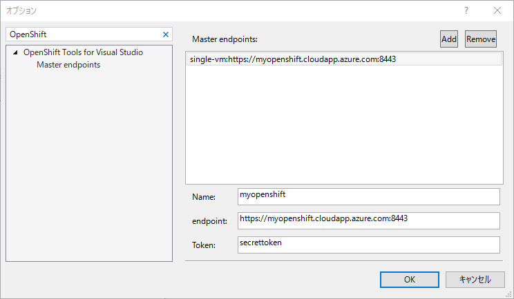
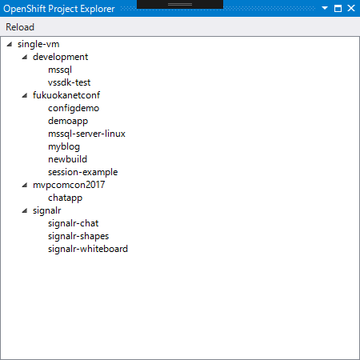
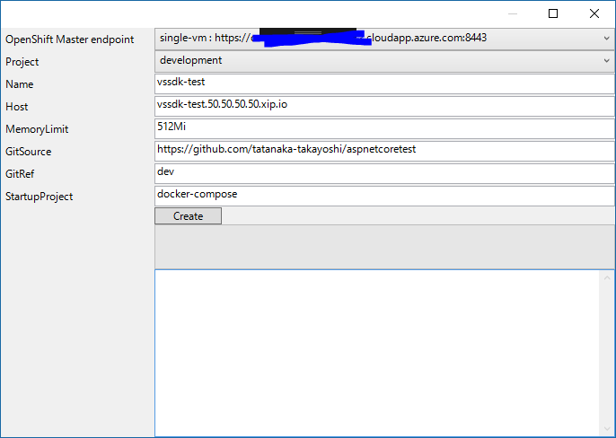
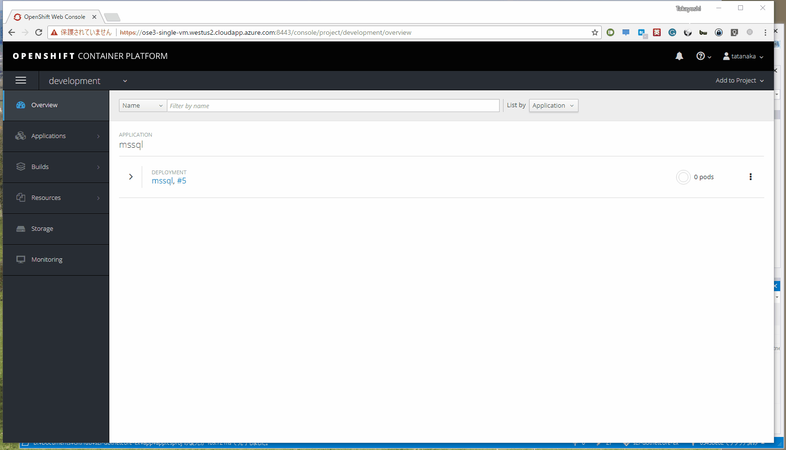

# OpenShift Tools For Visual Studio

## Download

Download and install from [Visual Studio Marketplace](https://marketplace.visualstudio.com/items?itemName=tanaka733.vstoolsforopenshifttanaka733).

## How to use

### Configure Master endpoint

### List projects and deploymentconfigs

### Deploy to OpenShift

Note that you have to push your code to git server before deploying. This tools doesn't transfer your local code to OpenShift. This tool just creates a build configuration and OpenShift will close your codes from specified git server.

## Support

This is not an official tool. If you have any questions or you find any issue, please file an issue on this GitHub.

## Develop

TBD

## License

[MIT License](https://github.com/tanaka-takayoshi/OpenShift.Vsix/blob/master/LICENSE)